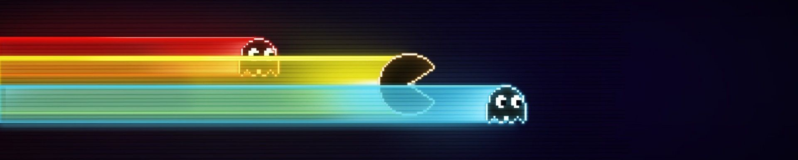

<div style="text-align: center;">
  
  
</div>

# Welcome to DangerousWiki

DangerousWiki is the official wiki for the Rick Dangerous RetroPie project.

This Wiki collects guides and information all about the Rick Dangerous Project, RetroPie and hardware recommended for use with RetroPie.

## Website

The site currently is deployed under https://azureorange404.github.io/DangerousWiki/ and maintained by @AzureOrange404 and @SSPPAAMM.

## Contributing to the project

If you want to help and contribute to the project, do not hesitate to create a fork of the project and a pull request with your addition to be merged with the main branch.

It is adviced to contact @AzureOrange404 or @SSPPAAMM if you did so.

### Markdown

The pages of this website are written in markdown. You will find a template [here](/docs/template.md).

Markdown is a lightweight and easy-to-use syntax for styling your writing. It includes conventions for:

```markdown
Syntax highlighted code block

# Header 1
## Header 2
### Header 3

- Bulleted
- List

1. Numbered
2. List

**Bold** and _Italic_ and `Code` text

[Link](url) and 
```

For more details see [Basic writing and formatting syntax](https://docs.github.com/en/github/writing-on-github/getting-started-with-writing-and-formatting-on-github/basic-writing-and-formatting-syntax).

### HTML

Some elements have to be written in HTML, because markdown does not provide their functionalities.

e.g. page centered images:

```
<div style="text-align: center;">
  
  
</div>
```
or Dropdown lists:
```
<details>
  <summary>[NAME]</summary>
</br>
  
  Content of the dropdown
</details>
```

### Jekyll Themes

This Pages site will use the layout and styles from the Jekyll theme.

### Support or Contact

Having trouble? Contact us in our discord channel.
